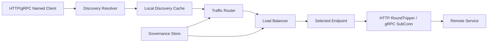

# 负载均衡模型设计

本文描述 Stellar 中客户端侧负载均衡的设计模型、职责边界、扩展方式和当前设计审查结论。

## 设计目标

- 负载均衡位于 discovery 服务发现之上，不直接访问注册中心。
- 请求路径先执行流量路由，再执行负载均衡。
- HTTP client 和 gRPC client 使用同一套抽象模型。
- 默认负载均衡策略为 `p2c`。
- 预留服务治理规则下发入口，后续可以由治理客户端动态更新路由规则、权重、熔断、限流和异常实例摘除规则。
- 业务代码默认不需要感知 endpoint 选择细节，只通过 named client 发起调用。

## 核心链路

```text
named client
-> discovery resolver
-> local discovery cache
-> traffic router
-> load balancer
-> selected endpoint
-> client transport
-> remote service
```

### 分层职责

| 层级 | 职责 | 不应该做的事 |
| --- | --- | --- |
| `discovery.Resolver` | 从注册中心发现服务实例，并维护本地缓存 | 不解析完整治理语义，不做请求级负载均衡 |
| `loadbalancer.Router` | 根据请求、治理规则和 endpoint 元数据筛选候选实例 | 不访问注册中心，不做最终 endpoint 选择 |
| `loadbalancer.Balancer` | 在候选实例集合内选择一个 endpoint | 不关心路由规则来源，不修改治理规则 |
| HTTP/gRPC client adapter | 将选中的 endpoint 落到真实出站调用 | 不暴露底层地址选择细节给业务代码 |

## 架构图



## 关键接口

当前核心抽象在 `loadbalancer` 包中：

```go
type Router interface {
	Route(context.Context, Request, []discovery.Endpoint) ([]discovery.Endpoint, error)
}

type Balancer interface {
	Pick(context.Context, Request, []discovery.Endpoint) (Pick, error)
}
```

`Request` 表达一次出站调用的路由上下文，包括协议、服务名、方法、路径、目标地址、请求头和扩展属性。HTTP client 会从 `http.Request` 构造该对象；gRPC client 会从 `PickInfo.FullMethodName` 和 outgoing metadata 构造该对象。

`Pick.Done(Result)` 是负载均衡策略接收调用结果反馈的入口，用于更新 active request、延迟和错误统计。

## 流量路由

Traffic Router 在负载均衡之前执行。它的输入是 discovery cache 中的全量候选 endpoint，输出是被治理规则筛选后的 endpoint 子集。

当前支持的规则字段：

- `protocol`
- `endpoint_name`
- `zone`
- `instance_ids`
- `labels`
- `metadata`

`GovernanceRouter` 从 `governance.Store` 读取 `route` 类型规则。规则下发不应该重建 client，也不应该重建 interceptor chain；治理客户端只需要解析远端规则并原子替换本地 snapshot。

```text
governance server
-> governance client watcher
-> validate route rules
-> governance.Store.Replace(snapshot)
-> GovernanceRouter reads snapshot at request time
```

### 路由失败策略

当前路由是 fail-open：

- 没有命中规则时，返回原始 endpoint 集合。
- 命中规则但筛选结果为空时，继续尝试后续规则。
- 所有规则都无法产生候选实例时，回退到原始 endpoint 集合或 fallback router。

这个默认适合框架第一阶段，优先保证可用性。但严格隔离、灰度强约束、黑名单和单元化流量需要 fail-closed 能力，后续应该在治理规则中增加 `action` 或 `fail_on_empty` 语义。

## 负载均衡策略

| 策略 | 配置值 | 说明 | 适用场景 |
| --- | --- | --- | --- |
| P2C | `p2c` | 默认策略，随机取两个 endpoint，按 active request、延迟、错误和权重计算分数后选择更优者 | 通用微服务调用 |
| Round Robin | `round_robin` | 按顺序轮询 endpoint | 简单均衡、调试 |
| Random | `random` | 随机选择 endpoint | 简单无状态场景 |
| Weighted Round Robin | `weighted_round_robin` | 根据 endpoint weight 做加权轮询 | 静态容量差异 |
| Least Request | `least_request` | 扫描候选集合，选择当前分数最低的 endpoint | 小规模实例、对实时负载敏感 |
| Consistent Hash | `consistent_hash` | 使用虚拟节点 hash ring，根据 hash key 稳定选择 endpoint | 会话亲和、租户亲和 |

### P2C 默认策略

P2C 的选择过程：

```text
candidate endpoints
-> random pick two endpoints
-> calculate endpoint score
-> select lower score endpoint
-> update active count
-> call Done(result) after request completes
```

当前分数模型：

```text
score = (active_requests * 1000 + latency_ms + error_count * 100) / weight
```

这个模型的目标是让高并发、高延迟、高错误的 endpoint 更不容易被选中，同时保留注册中心或治理规则下发的权重影响。

### Consistent Hash

`consistent_hash` 会按 endpoint key 构建虚拟节点 hash ring。默认从下面顺序获取 hash key：

1. `Request.HashKey`
2. `x-stellar-lb-key` header
3. `Request.Target`
4. `Request.Path`

如果没有任何 hash key，则回退到 P2C。

## HTTP Client 接入

HTTP named client 配置 discovery 后，框架会创建：

```text
CachedResolver
-> loadbalancer.Director
-> loadBalancingRoundTripper
```

请求执行时：

```text
http.Request
-> build loadbalancer.Request
-> director.Pick()
-> rewrite request URL with selected endpoint
-> base RoundTripper
-> pick.Done(result)
```

HTTP 的实际地址改写必须发生在 transport 层，因此负载均衡不是普通业务 interceptor。它属于框架客户端链路的一部分；interceptor 可以通过 context 补充路由上下文，最终由 RoundTripper 完成 endpoint 选择和 URL 改写。

## gRPC Client 接入

gRPC named client 配置 discovery 后，框架会创建：

```text
CachedResolver
-> manual gRPC resolver
-> Stellar custom gRPC balancer
```

resolver 会把 `discovery.Endpoint` 写入 `resolver.Address` 的 attributes。gRPC balancer 在 `Pick` 阶段执行：

```text
ready SubConns
-> endpoints from resolver address attributes
-> traffic router
-> load balancer
-> selected SubConn
-> pick.Done(result)
```

gRPC 的路由 service 默认使用 discovery target service，也就是 named client 对应的下游服务名；protobuf service 会放入 `Request.Attributes["grpc.service"]`，用于后续更细粒度治理。

## 配置示例

```yaml
http:
  client:
    clients:
      user-service:
        discovery:
          enabled: true
          service: user-service
          protocol: http
          endpoint_name: http
          load_balance: p2c

grpc:
  client:
    clients:
      user-service:
        discovery:
          enabled: true
          service: user-service
          protocol: grpc
          endpoint_name: grpc
          load_balance: p2c
```

`load_balance` 为空或未知时会回退到 `p2c`。

## 服务治理规则下发预留

后续治理 SDK 接入时，建议采用下面的规则链路：

```text
remote governance rules
-> governance client watcher
-> parse and validate
-> normalize rule kind and scope
-> governance.Store.Replace(snapshot)
-> Router/Balancer read local snapshot at request time
```

负载均衡模块不应该直接持有远端治理客户端，也不应该在请求路径访问治理服务。请求路径只读本地内存快照。

推荐后续规则类型：

- `route`：实例筛选、灰度、标签路由、zone 路由。
- `load_balance`：策略选择、hash key、权重覆盖。
- `outlier_detection`：异常实例摘除。
- `circuit_breaker`：熔断。
- `rate_limit`：限流。
- `retry`：重试。

## 可观测性边界

当前 registry/discovery 已经有独立 OpenTelemetry metrics。负载均衡后续应该补充独立指标，不应该复用 discovery 指标表达所有行为。

建议指标：

- `loadbalancer.pick.count`
- `loadbalancer.pick.duration`
- `loadbalancer.pick.failure.count`
- `loadbalancer.route.filtered_endpoints`
- `loadbalancer.available_endpoints`
- `loadbalancer.inflight_requests`
- `loadbalancer.endpoint.error.count`
- `loadbalancer.endpoint.latency`

建议属性：

- `protocol`
- `service`
- `policy`
- `router`
- `endpoint`
- `zone`
- `outcome`

## 设计审查结论

整体设计方向是合理的：discovery、traffic router、load balancer 和 client transport 的边界清晰，HTTP/gRPC 可以共享同一套抽象，同时保留服务治理规则下发入口。

当前没有发现会阻塞第一阶段使用的架构问题，但存在下面这些需要明确记录的设计风险。

### 1. 路由默认 fail-open

优点是注册中心短暂抖动或规则配置错误时不容易直接打断业务流量。

风险是强隔离、单元化、灰度白名单等场景下，空路由结果回退到全量 endpoint 可能违反预期。

建议后续在 route 规则中增加：

- `fail_on_empty`
- `fallback`
- `action: allow | deny | fallback`

### 2. P2C 统计是进程本地视角

当前 active request、延迟和错误统计只在当前客户端进程内生效。多个调用方实例之间不会共享实时负载状态。

这是客户端负载均衡的常见边界，不是阻塞问题。后续如果要跨客户端协调，需要结合服务端负载上报、ORCA、注册中心 metadata 或治理面聚合状态。

### 3. 错误统计暂时没有衰减窗口

当前 error count 是累计值，长期运行后可能让某个曾经失败的 endpoint 被持续惩罚。

建议后续改为 EWMA error rate、滑动窗口或 outlier detection，把错误恢复和实例重新进入流量池作为治理能力处理。

### 4. Weighted Round Robin 不是 Smooth Weighted Round Robin

当前 `weighted_round_robin` 是简单加权轮询。它能表达基础权重，但在权重差异较大时不如 smooth weighted round robin 平滑。

建议后续如果要用于生产灰度比例控制，改为平滑加权轮询或直接交给 traffic split 规则。

### 5. Consistent Hash 已使用虚拟节点 ring，但仍是轻量实现

当前实现已经避免简单取模导致的顺序敏感问题，并使用虚拟节点 hash ring 减少 endpoint 变化时的 key 大规模迁移。

仍需注意：

- hash ring 当前在每次 pick 时按候选 endpoint 构建。
- 大规模 endpoint 场景下应该缓存 ring，并在 endpoint 快照变化时重建。
- 生产级一致性哈希还需要更明确的 virtual node 数量配置和 hash key 规则下发。

### 6. gRPC balancer builder 使用动态名称注册

当前每个 discovery gRPC client 会注册一个唯一 balancer name，用于携带不同的策略和 router。

这对常规 named client 是可接受的，因为 named client 通常在启动阶段创建，数量有限。风险是如果业务在运行时高频创建临时 gRPC client，会造成全局 balancer registry 增长。

建议后续改为稳定 builder + per target config registry，或者由 App 生命周期统一管理 named client。

### 7. HTTP dynamic client 生命周期需要继续收敛

HTTP discovery client 内部会创建 cached resolver。对于框架启动时创建的 named client，这通常跟随进程生命周期即可；但如果业务高频动态创建 client，应该有显式 Close 或由 App 管理 client factory。

建议后续增加：

- `App.HTTPClient(name)` 缓存 named client。
- closeable client factory。
- 应用停止时统一关闭 discovery resolver。

### 8. 负载均衡不是普通业务 interceptor

HTTP 的真实地址改写必须发生在 RoundTripper，gRPC 的 SubConn 选择必须发生在 gRPC balancer。因此负载均衡不能完全做成普通业务 interceptor。

合理定位是：负载均衡属于框架客户端出站链路的 `route_resolve` 能力位；业务 interceptor 可以补充路由上下文，但最终 endpoint 选择由 HTTP transport wrapper 或 gRPC balancer 完成。

### 9. 尚未实现异常实例摘除

当前 P2C 会根据错误和延迟降低 endpoint 被选中的概率，但不会真正 eject endpoint。

异常摘除应该独立为 outlier detection 治理能力，避免把摘除语义硬编码进基础负载均衡策略。

## 推荐演进顺序

1. 增加 load balancer OpenTelemetry metrics。
2. 增加 route rule 的 fail-open/fail-closed 语义。
3. 增加 `load_balance` governance rule，支持动态切换策略和 hash key。
4. 增加 outlier detection。
5. 收敛 named client 生命周期，避免重复创建 resolver 和 gRPC balancer builder。
6. 对 consistent hash ring 做快照级缓存。

## 结论

当前模型可以作为 Stellar 第一阶段客户端负载均衡架构：它把 discovery、流量路由、负载均衡和 client transport 分开，默认 P2C 适合通用微服务场景，并且为后续服务治理规则下发保留了清晰入口。

需要注意的是，强治理语义、异常摘除、全局负载反馈、负载均衡指标和 client 生命周期管理还没有完全闭环，应该作为下一阶段治理能力继续建设。
