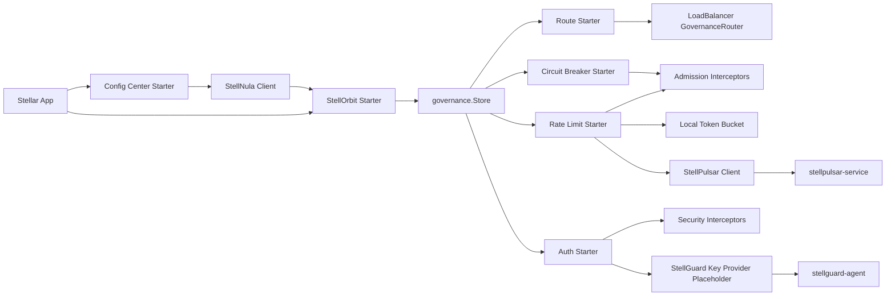

# 服务治理实现设计

本文描述 Stellar 接入 `stellorbit-go-sdk` 后的服务治理实现方案。目标是把治理规则的同步、解析和本地快照管理放在统一治理层，把路由、熔断、鉴权、限流拆成可独立启用的 starter，让业务应用可以按需选择能力。

## 问题分析

`stellorbit-go-sdk` 是 StellOrbit 服务治理 SDK，规则由 `stellorbit-service` 编排、校验和发布，并通过 `stellnula-service` 配置中心下发。Stellar 接入 StellOrbit 时不能把规则执行逻辑写进 SDK 适配层，而应该遵循当前 `governance.Store`、负载均衡路由和 interceptor 模型：

- StellOrbit 负责治理规则来源、规则 provider、本地 SDK 侧规则注册表和兼容 HTTP API。
- StellNula 负责配置中心连接、规则快照同步、监听和本地配置快照。
- Stellar 负责把远端治理规则转换为框架本地 `governance.Store` 快照，并在请求路径执行规则。
- 四类执行能力必须拆成独立 starter：路由、熔断、鉴权、限流。
- 启用 StellOrbit 治理时必须默认具备配置中心地址；没有配置中心地址时应该在启动期 fail fast。
- 分布式限流不由 StellOrbit SDK 本地实现，应通过 `stellpulsar-go-sdk` 访问 `stellpulsar-service`。
- 鉴权需要依托 `stellguard-agent` 提供公私钥或证书材料；这部分当前先保留占位和配置契约。

这意味着治理接入要分成两层：

1. 规则同步层：启动 StellNula 与 StellOrbit client，将远端规则转换并原子替换到 `governance.Store`。
2. 规则执行层：四个 starter 分别在负载均衡、HTTP/gRPC interceptor、限流器或鉴权器中读取本地快照。

## 设计目标

- 用户可以通过 `application.yaml` 配置启用服务治理。
- 默认治理 adapter 为 `stellorbit`。
- 接入 StellOrbit 时默认要求配置中心 adapter 为 `stellnula`，并且必须能解析到配置中心 endpoint。
- 路由、熔断、鉴权、限流四个 starter 独立启用，互不强制依赖。
- 限流 starter 同时支持单机限流和分布式限流。
- 单机限流和分布式限流都支持否决式限流和阻塞式限流，调用层使用同一套上层抽象。
- 鉴权 starter 先提供配置模型、规则匹配和 key provider 占位，后续接入 `stellguard-agent`。
- 治理规则更新不重建 client、router 或 interceptor chain，只替换本地 immutable snapshot。
- 请求路径只读本地内存快照，禁止同步访问 StellOrbit 或 StellNula。

## 非目标

- 不在 Stellar 核心包内实现完整服务治理控制面。
- 不在 StellOrbit 适配层实现熔断状态机、限流桶、鉴权拦截器和路由执行器。
- 不在分布式限流热路径做强一致全局计数。
- 不在第一阶段实现 StellGuard Agent 的完整 key/cert 拉取逻辑。
- 不把路由、熔断、鉴权、限流做成业务 interceptor；它们是框架治理 starter。

## 总体架构



核心链路：

```text
application.yaml
-> config center bootstrap
-> StellNula client
-> StellOrbit client
-> parse and normalize governance rules
-> governance.Store.Replace(snapshot)
-> route / circuit breaker / auth / rate limit starters read snapshot at request time
```

## 配置模型

Stellar 现有配置中心模型使用 `config_center`。服务治理新增 `governance` 顶层配置，默认 adapter 为 `stellorbit`。

```yaml
app:
  name: order-service
  env: dev

config_center:
  enabled: true
  adapter: stellnula
  endpoint: http://localhost:8060
  app_id: order-service
  client_id: order-service-local
  env: dev
  watch_enabled: true

governance:
  enabled: true
  adapter: stellorbit
  app_id: order-service
  env: dev
  fail_fast_on_bootstrap: true
  config_center:
    adapter: stellnula
    endpoint: http://localhost:8060
    namespace: governance
    group: service-governance
  route:
    enabled: true
  circuit_breaker:
    enabled: true
  rate_limit:
    enabled: true
    mode: local
    behavior: reject
    local:
      algorithm: token_bucket
      default_rate: 100
      default_burst: 200
    distributed:
      enabled: false
      adapter: stellpulsar
      address: 127.0.0.1:9090
      api_token: local-dev-token
      timeout: 100ms
      fallback: fail_open
  auth:
    enabled: false
    key_provider:
      adapter: stellguard-agent
      endpoint: http://localhost:8080
      spiffe_id: spiffe://stell.local/workload/order-service
      token: local-dev-token
      placeholder: true
```

配置继承规则：

- `governance.adapter` 为空时默认使用 `stellorbit`。
- `governance.config_center.adapter` 为空时默认使用 `stellnula`。
- `governance.config_center.endpoint` 为空时继承 `config_center.endpoint`。
- `governance.app_id` 为空时继承 `app.name` 或 `config_center.app_id`。
- `governance.env` 为空时继承 `app.env` 或 `config_center.env`。
- `governance.enabled=true` 且无法解析配置中心 endpoint 时启动失败。
- `governance.rate_limit.mode=distributed` 时必须配置 `governance.rate_limit.distributed.address`。
- `governance.auth.enabled=true` 且 key provider 仍为占位实现时默认启动失败，除非显式配置 `placeholder: true`。

## Starter 拆分

| Starter | 建议包名 | 规则类型 | 挂载点 | 依赖 |
| --- | --- | --- | --- | --- |
| StellOrbit 规则 starter | `governance/stellorbit` | all | App 启动期和配置监听 | `stellorbit-go-sdk`, `stellnula-go-sdk` |
| 路由 starter | `governance/route` | `route` | HTTP/gRPC client load balancer router | `governance.Store`, `loadbalancer.GovernanceRouter` |
| 熔断 starter | `governance/circuitbreaker` | `circuit_breaker` | HTTP/gRPC client `admission` | `governance.Store` |
| 限流 starter | `governance/ratelimit` | `rate_limit` | HTTP/gRPC server/client `admission` | local bucket, optional `stellpulsar-go-sdk` |
| 鉴权 starter | `governance/auth` | `authentication`, `authorization`, `signing` | HTTP/gRPC server/client `security` | key provider placeholder, future `stellguard-agent` |

StellOrbit 规则 starter 是公共前置能力。四个规则执行 starter 不直接连接 StellOrbit 或 StellNula，只读取 `governance.Store`。这样规则更新不会触发执行链重建，执行链也不会被远端配置中心延迟影响。

## StellOrbit 规则同步

StellOrbit 规则 starter 的职责：

1. 校验 `governance` 和 `config_center` 配置。
2. 创建或复用 StellNula 配置中心 client。
3. 创建 `stellorbit-go-sdk` client，并传入 StellNula endpoint、app id、client id、env、labels 和观测对象。
4. 启动 StellOrbit client，订阅 `governance/service-governance` 规则通道。
5. 将 StellOrbit provider 输出的 route、breaker、auth、rate limit 规则转换为 Stellar 本地 `governance.Rule`。
6. 对规则 kind、scope、priority、version、metadata 和 spec 做规范化。
7. 使用 `governance.Store.Replace(snapshot)` 原子替换快照。
8. 规则更新失败时保留 last-known-good 快照。

规则转换原则：

- 远端规则 ID 映射为 `governance.Rule.ID`。
- 远端规则类型映射为 `governance.Rule.Kind`。
- 远端规则匹配条件映射为 `governance.Scope` 和 `Spec`。
- 远端 revision/checksum 写入 `Version` 或 `Metadata`。
- 不认识的规则字段保留在 `Spec` 中，不阻塞已知字段执行。

## 路由 Starter

路由 starter 读取 `route` 规则并接入现有负载均衡模型：

```text
governance.Store
-> loadbalancer.GovernanceRouter
-> loadbalancer.Director
-> HTTP RoundTripper / gRPC Balancer
```

实现要求：

- 默认只影响启用 discovery 的 named client。
- 规则为空时保持现有负载均衡行为。
- 路由筛选失败默认 fail-open，后续通过规则字段支持 fail-closed。
- 不在请求路径访问 StellOrbit HTTP API。
- 不重建 HTTP client、gRPC client 或 balancer。

## 熔断 Starter

熔断 starter 负责把 `circuit_breaker` 规则转换为请求路径上的本地熔断器：

- client 侧默认挂载在 HTTP/gRPC `admission`。
- server 侧可以预留挂载点，用于保护本服务昂贵入口。
- 熔断器实例按服务、方法、路径、目标或自定义 resource key 分桶。
- 状态机至少包含 closed、open、half-open。
- 本地拒绝不能被 retry 统计为下游失败。
- 规则更新时只更新参数和新建资源桶，不清空仍可复用的运行时统计。

建议失败策略：

- 规则解析失败：保留 last-known-good。
- 没有匹配规则：放行。
- 熔断器 open：快速拒绝，并记录治理指标。
- half-open 探测请求：受规则的并发探测数限制。

## 限流 Starter

限流 starter 需要把单机限流和分布式限流抽象到同一层，避免业务或 interceptor 感知底层实现差异。

### 上层抽象

建议抽象为：

```go
type LimitBehavior string

const (
	LimitBehaviorReject LimitBehavior = "reject"
	LimitBehaviorBlock  LimitBehavior = "block"
)

type Limiter interface {
	Allow(ctx context.Context, request LimitRequest) (LimitDecision, error)
	Wait(ctx context.Context, request LimitRequest) (LimitDecision, error)
}
```

- `Allow` 表达否决式限流，没有配额时立即返回 denied decision。
- `Wait` 表达阻塞式限流，没有配额时等待 token 或等待远端返回，直到 context 超时或取消。
- interceptor 根据 `behavior` 选择 `Allow` 或 `Wait`。
- local limiter 和 distributed limiter 都实现同一接口。

### 单机限流

单机限流默认使用进程内 token bucket：

- 优点是无远端依赖、低延迟、适合作为基础保护。
- 统计和配额只在单进程内有效。
- 适合服务端入口保护、客户端保护、单实例任务和本地开发。

执行链路：

```text
rate_limit rule
-> resource key
-> local bucket
-> Allow / Wait
-> allow or reject
```

### 分布式限流

分布式限流通过 `stellpulsar-go-sdk` 接入 `stellpulsar-service`：

```text
rate_limit rule
-> resource key / quota key
-> stellpulsar-go-sdk
-> stellpulsar-service AcquireQuota
-> allowed / limited / fallback
```

实现要求：

- `mode=distributed` 时由 `stellpulsar-go-sdk` 负责远端配额判定。
- StellPulsar client 需要接收 StellOrbit client 或规则 provider，以便和远端限流规则保持 revision/checksum 对齐。
- quota key 应由上层规则统一计算，避免 SDK adapter 各自重复拼接。
- 远端超时、拓扑不可用、非 owner 响应等情况按 `fallback` 处理。
- 默认 fallback 建议为 `fail_open`，强保护场景可以配置为 `fail_closed`。

### 否决式与阻塞式

两种行为必须位于上层抽象，不应该拆成两个 starter：

| 行为 | 配置值 | 语义 | 适用场景 |
| --- | --- | --- | --- |
| 否决式限流 | `reject` | 没有配额立即拒绝请求 | API 网关、服务端入口保护、低延迟链路 |
| 阻塞式限流 | `block` | 没有配额时等待，直到拿到配额或 context 超时 | 后台任务、批处理、可排队写入 |

阻塞式限流必须遵守 request context，禁止无限等待。

## 鉴权 Starter

鉴权 starter 读取 `authentication`、`authorization` 和 `signing` 规则，挂载在 HTTP/gRPC `security` 阶段。

当前占位实现边界：

- 提供 `key_provider` 配置模型。
- 预留 `stellguard-agent` adapter。
- 预留公钥、私钥、trust bundle、SPIFFE ID、证书文件路径和轮转通知模型。
- 在 `auth.enabled=false` 时不挂载执行器。
- 在 `auth.enabled=true` 且 key provider 未真实可用时默认 fail fast。
- 允许开发环境显式设置 `placeholder: true` 进入空实现，但必须输出 warning。

未来接入 `stellguard-agent` 后：

- server 侧可读取 trust bundle 和公钥集合做 mTLS/JWT/签名校验。
- client 侧可读取私钥或证书材料做请求签名或 mTLS。
- key/cert 轮转不重建业务 handler，只替换本地 key snapshot。

## 与 Interceptor 阶段的关系

治理 starter 应注册框架 interceptor，而不是业务 interceptor。

| 能力 | Server 阶段 | Client 阶段 | 说明 |
| --- | --- | --- | --- |
| 路由 | 不适用 | `route_resolve` / transport balancer | HTTP 地址改写和 gRPC SubConn 选择不适合普通 interceptor |
| 熔断 | 可选 `admission` | `admission` | 本地拒绝不进入 retry 和签名 |
| 限流 | `admission` | `admission` | 身份无关限流放 admission，身份相关限流可在 security 后二次执行 |
| 鉴权 | `security` | `security` | 认证、授权和签名靠近真实业务或真实传输 |

## 启动顺序

推荐启动顺序：

1. 解析本地 `application.yaml`。
2. 启动配置中心 bootstrap，合并远端 `application.yaml`。
3. 归一化 `governance` 配置。
4. 如果启用治理，校验 StellNula endpoint。
5. 启动 StellOrbit 规则 starter，完成第一次规则同步。
6. 注册路由、熔断、限流、鉴权 starter。
7. 启动 HTTP/gRPC server/client factory。
8. 后台监听治理规则更新并替换 `governance.Store`。

启动期失败策略：

- `governance.enabled=false`：跳过所有治理 starter。
- `governance.enabled=true` 且缺少配置中心 endpoint：fail fast。
- `fail_fast_on_bootstrap=true` 且首次规则同步失败：fail fast。
- `fail_fast_on_bootstrap=false` 且首次规则同步失败：使用空快照启动，并持续后台恢复。

## 可观测性

治理 starter 应使用框架统一 OpenTelemetry 对象输出指标。建议指标：

| 指标 | 类型 | 说明 |
| --- | --- | --- |
| `governance.rule.sync.count` | counter | 规则同步次数，按 outcome 标记成功或失败 |
| `governance.rule.snapshot.version` | gauge | 当前快照版本或可转数字版本 |
| `governance.route.match.count` | counter | 路由规则命中次数 |
| `governance.circuitbreaker.state.change.count` | counter | 熔断状态变化次数 |
| `governance.circuitbreaker.reject.count` | counter | 熔断拒绝次数 |
| `governance.ratelimit.allow.count` | counter | 限流放行次数 |
| `governance.ratelimit.reject.count` | counter | 否决式限流拒绝次数 |
| `governance.ratelimit.wait.duration` | histogram | 阻塞式限流等待耗时 |
| `governance.auth.allow.count` | counter | 鉴权放行次数 |
| `governance.auth.deny.count` | counter | 鉴权拒绝次数 |

建议通用属性：

- `adapter`
- `rule_kind`
- `rule_id`
- `transport`
- `service`
- `method`
- `resource`
- `mode`
- `behavior`
- `outcome`

## 验证清单

- 配置解析：覆盖治理默认 adapter、配置中心 endpoint 继承、缺失配置 fail fast。
- 规则同步：使用 fake StellOrbit provider 验证快照替换、last-known-good 和无效规则跳过。
- 路由：验证 `route` 规则能影响 HTTP/gRPC named client 的候选 endpoint。
- 熔断：验证 open、half-open、closed 状态和本地拒绝不会进入 retry。
- 单机限流：验证 `reject` 和 `block` 两种行为，并覆盖 context 超时。
- 分布式限流：使用 fake StellPulsar client 验证 allowed、limited、fallback、timeout。
- 鉴权占位：验证默认关闭、启用但 provider 未实现时 fail fast、placeholder 显式放行。
- 可观测性：验证治理 starter 使用框架统一 OpenTelemetry provider 注册指标。
- 回归：执行 `go test ./...`，文档变更执行 `git diff --check`。

## 推荐落地顺序

1. 增加 `GovernanceConfig` 配置结构和默认值归一化。
2. 接入 StellOrbit 规则 starter，并把规则转换为 `governance.Store` 快照。
3. 接入路由 starter，复用 `loadbalancer.GovernanceRouter`。
4. 接入熔断 starter，先支持 client 侧基础状态机。
5. 接入限流 starter，先完成本地 token bucket，再接入 `stellpulsar-go-sdk`。
6. 接入鉴权 starter 占位，实现配置、规则匹配和 fail fast 语义。
7. 增加 examples，分别展示路由、熔断、鉴权占位、单机限流和分布式限流。
8. 补齐治理指标和测试。

## 参考

- [stellhub/stellorbit-go-sdk](https://github.com/stellhub/stellorbit-go-sdk)
- [stellhub/stellorbit-service](https://github.com/stellhub/stellorbit-service)
- [stellhub/stellnula-go-sdk](https://github.com/stellhub/stellnula-go-sdk)
- [stellhub/stellpulsar-go-sdk](https://github.com/stellhub/stellpulsar-go-sdk)
- [stellhub/stellpulsar-service](https://github.com/stellhub/stellpulsar-service)
- [stellhub/stellguard-agent](https://github.com/stellhub/stellguard-agent)
